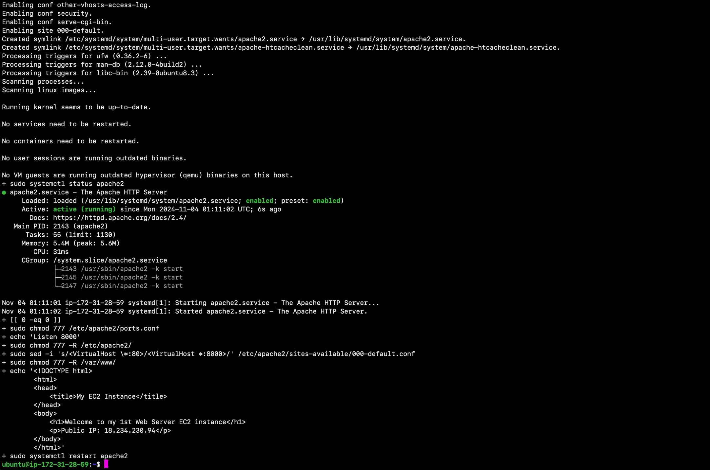

# Automating Load Balancer Configuration With Shell Scripting
------------------------------------------------------------
### Overview

Hello and welcome! My name is Cecilia, and in this amazing project, I will demonstrate the deployment of Nginx as a Load balancer using shell script. This project demonstrates the automated deployment of a highly available web infrastructure on AWS using shell scripting. The implementation features two Apache web servers distributed behind an Nginx load balancer, showcasing infrastructure automation best practices.

**Technical Stack**

*Cloud Platform*: Amazon Web Services (AWS)
*Web Servers*: Apache HTTP Server
*Load Balancer*: Nginx
*Operating System*: Ubuntu Server 24.04 LTS
*Scripting*: Bash shell scripts
*Infrastructure*: EC2 instances

**Architecture**

The infrastructure consists of three main components:
1) *Load Balancer Layer*: Nginx server handling traffic distribution
2) *Application Layer*: Two Apache web servers serving content
3) *Security Layer*: AWS Security Groups managing access control

--------------------------------------------------------------------------

### PART 1: Provisioning an EC2 Instance for the 1st Web Server

 **Access AWS Console**
   - Log into AWS Management Console
   - Navigate to EC2 Dashboard

 **Launch Instance**
   - Click the "Launch Instance" button
   - Enter "Web Server 1" as instance name

 **Select AMI**
   - Choose Ubuntu Server 24.04 LTS (HVM) from AMI catalog
   - Verify t2.micro Instance Type is selected

 **Create Key Pair**
   - Click "Create new key pair"
   - Enter name: `webserver1`
   - Select RSA as key pair type
   - Choose `.pem` as file format
   - Download and securely store the key pair file

 **Configure Security Group**
   - Create new security group
   - Add inbound rules:
     ```
     Type: Custom TCP
     Port: 8000
     Source: 0.0.0.0/0
     
     Type: SSH
     Port: 22
     Source: 0.0.0.0/0
     ```

 **Launch**
   - Review configuration
   - Click "Launch Instance"


**Verification**

After launching the instance, verify the following:
- Instance status is "running"
- Ports 8000 and 22 are accessible in the security group


### Step 2: Connect to the 1st Web Server via the terminal using SSH
* Open the Terminal on your local computer.
* Run the following command to go to the directory (i.e. Downloads) where the `.pem` key pair file was downloaded.

```sh
cd Downloads
```

* Paste the following command to give read permissions to the `.pem` key pair file:

```sh
sudo chmod 400 <private-key-pair-name>.pem
```


* SSH into the **Web Server 1 Instance** using the command shown below:

```sh
ssh -i <private-key-name>.pem ubuntu@<Public-IP-address>
```


### Step 3: Deployment of the 1st Web Server
* Create and open a file `install.sh` using the command shown below:

```sh
sudo vi install.sh
```


* Paste the script shown below into the file then save and exit the file:

```sh
#!/bin/bash

####################################################################################################################
##### This automates the installation and configuring of apache webserver to listen on port 8000
##### Usage: Call the script and pass in the Public_IP of your EC2 instance as the first argument as shown below:
######## ./install_configure_apache.sh 18.234.230.94
####################################################################################################################

set -x # debug mode
set -e # exit the script if there is an error
set -o pipefail # exit the script when there is a pipe failure

PUBLIC_IP=

[ -z "${PUBLIC_IP}" ] && echo "Please pass the public IP of your EC2 instance as an argument to the script" && exit 1

sudo apt update -y &&  sudo apt install apache2 -y

sudo systemctl status apache2

if [[ $? -eq 0 ]]; then
    sudo chmod 777 /etc/apache2/ports.conf
    echo "Listen 8000" >> /etc/apache2/ports.conf
    sudo chmod 777 -R /etc/apache2/

    sudo sed -i 's/<VirtualHost \*:80>/<VirtualHost *:8000>/' /etc/apache2/sites-available/000-default.conf

fi
sudo chmod 777 -R /var/www/
echo "<!DOCTYPE html>
        <html>
        <head>
            <title>My EC2 Instance</title>
        </head>
        <body>
            <h1>Welcome to my 1st Web Server EC2 instance</h1>
            <p>Public IP: "${PUBLIC_IP}"</p>
        </body>
        </html>" > /var/www/html/index.html

sudo systemctl restart apache2
```


* Assign executable permissions on the file using the command shown below:

```sh
sudo chmod +x install.sh
```

* Run the shell script using the command shown below:

```sh
./install.sh
```



* Go to your web browser and paste the following URL to verify the setup:

```sh
http://public_ip_address_of_web_server_1:8000
```


Great job! You've successfully setup Web Server 1.

Logout of the server.

```sh
exit
```


Now let's repeat the process for Web Server 2.

### Step 4: Provision an EC2 Instance for the 2nd Web Server

**Launch Instance**
   - On the AWS Management Console, navigate to EC2 Dashboard
   - Click the "Launch Instance" button
   - Enter "Web Server 2" as instance name

 **Select AMI**
   - Choose Ubuntu Server 24.04 LTS (HVM) from AMI catalog
   - Verify t2.micro Instance Type is selected

 **Create Key Pair**
   - Click "Create new key pair"
   - Enter name: `webserver2`
   - Select RSA as key pair type
   - Choose `.pem` as file format
   - Download and securely store the key pair file

 **Configure Security Group**
   - Create new security group
   - Add inbound rules:
     ```
     Type: Custom TCP
     Port: 8000
     Source: 0.0.0.0/0
     
     Type: SSH
     Port: 22
     Source: 0.0.0.0/0
     ```

 **Launch**
   - Review configuration
   - Click "Launch Instance"

**Verification**

After launching the instance, verify the following:
- Instance status is "running"
- Ports 8000 and 22 are accessible in the security group


### Step 5: Connect to the 2nd Web Server via the terminal using SSH
* Open the terminal on your computer.
* Run the following command to go to the directory (i.e. Downloads) where the `.pem` key pair file was downloaded.

```sh
cd Downloads
```
* Paste the following command to give read permissions to the `.pem` key pair file:

```sh
sudo chmod 400 <private-key-pair-name>.pem
```

* SSH into the **Web Server 2 Instance** using the command shown below:

```sh
ssh -i <private-key-name>.pem ubuntu@<Public-IP-address>
```


### Step 6: Deployment of the 2nd Web Server
* Create and open a file `install.sh` using the command shown below:

```sh
sudo vi install.sh
```
* Paste the script shown below into the file then save and exit the file:

```sh
#!/bin/bash

####################################################################################################################
##### This automates the installation and configuring of apache webserver to listen on port 8000
##### Usage: Call the script and pass in the Public_IP of your EC2 instance as the first argument as shown below:
######## ./install_configure_apache.sh 18.234.230.94
####################################################################################################################

set -x # debug mode
set -e # exit the script if there is an error
set -o pipefail # exit the script when there is a pipe failure

PUBLIC_IP=

[ -z "${PUBLIC_IP}" ] && echo "Please pass the public IP of your EC2 instance as an argument to the script" && exit 1

sudo apt update -y &&  sudo apt install apache2 -y

sudo systemctl status apache2

if [[ $? -eq 0 ]]; then
    sudo chmod 777 /etc/apache2/ports.conf
    echo "Listen 8000" >> /etc/apache2/ports.conf
    sudo chmod 777 -R /etc/apache2/

    sudo sed -i 's/<VirtualHost \*:80>/<VirtualHost *:8000>/' /etc/apache2/sites-available/000-default.conf

fi
sudo chmod 777 -R /var/www/
echo "<!DOCTYPE html>
        <html>
        <head>
            <title>My EC2 Instance</title>
        </head>
        <body>
            <h1>Welcome to my 2nd Web Server EC2 instance</h1>
            <p>Public IP: "${PUBLIC_IP}"</p>
        </body>
        </html>" > /var/www/html/index.html

sudo systemctl restart apache2
```


* Assign executable permissions on the file using the command shown below:

```sh
sudo chmod +x install.sh
```

* Run the shell script using the command shown below:

```sh
./install.sh
```


* Go to your web browser and paste the following URL to verify the setup:

```sh
http://public_ip_address_of_web_server_2:8000
```


### Step 8: Provision an EC2 Instance for the Load Balancer

**Launch Instance**
   - On the AWS Management Console, navigate to EC2 Dashboard
   - Click the "Launch Instance" button
   - Enter `Load Balancer` as instance name

 **Select AMI**
   - Choose Ubuntu Server 24.04 LTS (HVM) from AMI catalog
   - Verify t2.micro Instance Type is selected

 **Create Key Pair**
   - Click "Create new key pair"
   - Enter name: `lbkeypair.pem`
   - Select RSA as key pair type
   - Choose `.pem` as file format
   - Download and securely store the key pair file

 **Configure Security Group**
   - Create new security group
   - Add inbound rules:
     ```
     Type: Custom TCP
     Port: 8000
     Source: 0.0.0.0/0
     
     Type: SSH
     Port: 22
     Source: 0.0.0.0/0
     ```

 **Launch**
   - Review configuration
   - Click "Launch Instance"

**Verification**

After launching the instance, verify the following:
- Instance status is "running"
- Ports 8000 and 22 are accessible in the security group


### Step 9: Connect to the Load Balancer via the terminal using SSH
* Open the terminal on your computer.
* Run the following command to go to the directory (i.e. Downloads) where the `.pem` key pair file was downloaded.

```sh
cd Downloads
```

* SSH into the **Load Balancer Instance** using the command shown below:

```sh
ssh -i <private-key-name>.pem ubuntu@<Public-IP-address>
```


### Step 10: Deploying and Configuring Nginx Load Balancer
* Create and open a file `nginx.sh` using the command shown below:

```sh
sudo vi nginx.sh
```

* Paste the script shown below into the file then save and exit the file:

```sh
#!/bin/bash

######################################################################################################################
##### This automates the configuration of Nginx to act as a load balancer
##### Usage: The script is called with 3 command line arguments. The public IP of the EC2 instance where Nginx is installed
##### the webserver urls for which the load balancer distributes traffic. An example of how to call the script is shown below:
##### ./configure_nginx_loadbalancer.sh PUBLIC_IP Webserver-1 Webserver-2
#####  ./configure_nginx_loadbalancer.sh 54.90.83.129 18.234.230.94:8000 54.175.35.61:8000
############################################################################################################# 

PUBLIC_IP=
firstWebserver=
secondWebserver=

[ -z "${PUBLIC_IP}" ] && echo "Please pass the Public IP of your EC2 instance as the argument to the script" && exit 1

[ -z "${firstWebserver}" ] && echo "Please pass the Public IP together with its port number in this format: 127.0.0.1:8000 as the second argument to the script" && exit 1

[ -z "${secondWebserver}" ] && echo "Please pass the Public IP together with its port number in this format: 127.0.0.1:8000 as the third argument to the script" && exit 1

set -x # debug mode
set -e # exit the script if there is an error
set -o pipefail # exit the script when there is a pipe failure


sudo apt update -y && sudo apt install nginx -y
sudo systemctl status nginx

if [[ $? -eq 0 ]]; then
    sudo touch /etc/nginx/conf.d/loadbalancer.conf

    sudo chmod 777 /etc/nginx/conf.d/loadbalancer.conf
    sudo chmod 777 -R /etc/nginx/

    
    echo " upstream backend_servers {

            # your are to replace the public IP and Port to that of your webservers
            server  "${firstWebserver}"; # public IP and port for webserver 1
            server "${secondWebserver}"; # public IP and port for webserver 2

            }

           server {
            listen 80;
            server_name "${PUBLIC_IP}";

            location / {
                proxy_pass http://backend_servers;   
            }
    } " > /etc/nginx/conf.d/loadbalancer.conf
fi

sudo nginx -t

sudo systemctl restart nginx
```


* Assign executable permissions on the file using the command shown below:

```sh
sudo chmod +x nginx.sh
```

* Run the shell script using the command shown below:

```sh
./nginx.sh
```


* Go to your web browser and paste the following URL to verify the setup:

```sh
http://public_ip_address_of_load_balancer:80
```


_Each time you refresh the page, you will see the web page of **Web Server 1** and **Web Server 2** as shown above._

Terminate the instances

